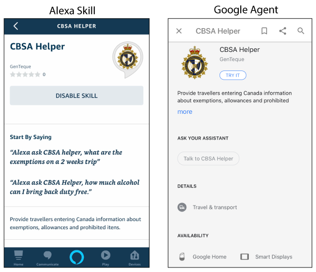
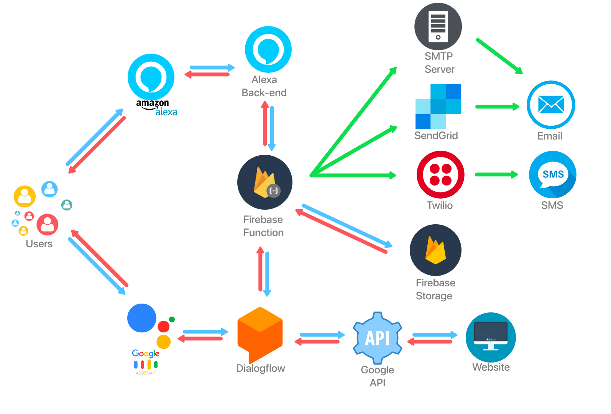

<!-- PROJECT LOGO -->
<p align="center">
  <a href="">
    
  </a>
  
  </br>          
  <h1 align="center">CBSA Helper</h1>
  
  <p align="center">
    </br>
    <a href="https://bot.dialogflow.com/96a34494-a331-4f68-807a-43f956ea865e" target="_blank">Chatbot Demo</a>
    ·
    <a href="#Contact">Contact Us</a>
  </p>
</p>

<!-- TABLE OF CONTENTS -->
## Table of Contents

* [About the Project](#about-the-project)
  * [Built With](#built-with)
* [Features](#features)
* [Design](#design)
  * [User Research](#userresearch)
  * [Product Research](#productresearch)
  * [Personas](#personas)
  * [User Stories & Usage Scenarios](#user-stories-usage-Scenarios)
  * [Information Architecture](#information-architecture)
  * [Paper Prototypes](#paper-prototypes)
  * [UI Wireframes](#ui-wireframes)
  * [Visual Design](#visual-design)
  * [Interactive Visual MockUp](#interactive-visual-mockup)
  * [Usability Testing Results](#usability-testing-results)
* [High-Level Architecture](#high-level-architecture)
* [Technical Research](#technical-research)
* [Getting Started](#getting-started)
  * [Prerequisites](#prerequisites)
  * [Installation](#installation)
* [Usage](#usage)
* [Roadmap](#roadmap)
* [Contact](#contact)
* [Acknowledgements](#acknowledgements)


<!-- ABOUT THE PROJECT -->
## About The Project


 
CBSA Helper is a voice application for Alexa and Google Home, to provide fast and easy to understand, information regarding travel exemptions, prohibited items and duties.
It is focused for travelers returning or entering Canada. The main purpouse is to be a trustable source, faster and easier than looking through a traditional website.

<!-- BUILT WITH -->
### Built With
* [Node.js](https://nodejs.org/en/)
* [Alexa](https://developer.amazon.com/en-US/alexa)
* [Dialogflow](https://dialogflow.com/)
* [Firebase](https://firebase.google.com/)

<!-- FEATURES -->
## Features
- Voice app to help travelers understand the rules and regulations on entering Canada from international travels as described in the dedicated website: https://www.cbsa-asfc.gc.ca/travel-voyage/ifcrc-rpcrc-eng.html
- Desirable features: Send e-mail or SMS to user with more details to the user when requested.
- Platforms: Alexa app, Amazon Echo, Google Home

<!-- DESIGN -->
## Design
**TO BE ADDED**
<!-- HIGH-LEVEL ARCHITECTURE -->
## High-Level Architecture
Alexa and Dialogflow communicate directly to Firebase Function, which contains the code published and the following interactions with Firebase Database, Twilio and Sandgrid occurr from there. Additionaly, Google has a chat platform, directly enabled from DialogFlow:


<!-- TECHNICAL RESEARCH -->
## Technical Research
The technical research started with a possibility of developing the Google Agent on Dialogflow and importing it to Alexa, the documents in the folder link below contains the research on that matter and also the Twillo usage for SMS and Sandgrid for Emails.


In a change of paradigmas, we foundded out that was possible to have one code published as a serverless function, and using it as endpoint on Alexa and Dialogflow. This discover was based on the work published on the link below:


<!-- GETTING STARTED -->
## Getting Started
The following topics will describe the requirements and how to get a local copy of the project to use in further implementations.

<!-- PREREQUISITES -->
### Prerequisites
- [x] GitHub code pulled to local machine
- [x] Alexa Developer Account
- [x] Dialogflow Account
- [x] Firebase Account

<!-- Instalation -->
### Installation
#### Initial setup
Clone the GitHub directory to your local machine, using Terminal:
```sh
git clone https://github.com/rign0002/GenTeque.git GenTeque
```

#### Installing components
To ensure you have all the standard components that the code need navigate on Terminal to functions folder and execute the install command as demonstraded below:
```sh
cd functions
npm install
```

#### Login to Firebase
On Terminal proceed the login command to connect your Firebase account:
```sh
firebase login
```
You will be prompted to your default browser to login using your firebase account, once the login is succeed you can close the browser window that oppened.

### Deploy to Firebase Function
Every time a change in the code is made, or a functionality is implemented you will need to deploy the code to Firebase Function, be sure you are logged on the Terminal window with your Firebase account, and execute the following command:
```sh
sudo firebase deploy
```

#### Emergency Kit
If for any reason you need to reinstall the firebase functions, proceed on Terminal as follows:
```sh
npm install firebase-functions@latest firebase-admin@latest --save
npm install -g firebase-tools
firebase login
firebase init functions
```

<!-- USAGE -->
## Usage
Usage flow example:


<!-- ROADMAP -->
## Roadmap
- Add more intents: We have added the intents that currently are refered on CBSA website, as regulations can change, any new intent will need to be added later.

- Publishing on Store: This project is not published on Alexa Store nor Google Store. We worked as far as we could to let the project in the final steps for publishing for the general public.

- Images: The project was focused only on voice, but Amazon and Google have devices with screen, we would suggest to implement some images in the resposes for the users that have this devices, we believe this will make their usage more friendly, instead of the device be only displaying text as currently does.

<!-- CONTACT -->
## Contact Us
**Project Lead:** [Thomas Sicard](mailto:sica0019@algonquinlive.com)

**Technical Lead:** [Marcos Zorzi Rosa](mailto:zorz0004@algonquinlive.com)

**Design Lead:** [Brandon Vervoort](mailto:verv0022@algonquinlive.com)

**Database Developer:** [Snehal Gondaliya](mailto:gond0017@algonquinlive.com)

**UX Researcher & API Developer:** [Rushikumar Patel](mailto:pate0672@algonquinlive.com)

**Developer:** [Justin Rignault](mailto:rign0002@algonquinlive.com)

<!-- ACKNOWLEDGEMENTS -->
## Acknowledgements
